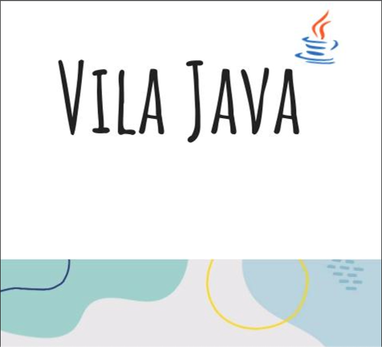

# Vila Java - Projeto Integrador

### Sobre

#### Branches
Contribuições em grupo
- feature/inboundOrder-US01
- feature/add-products-to-cart-US02
- feature/product-location-in-warehouse-US03
- feature/check-product-stock-in-warehouses-US04
- feature/testes-unitarios-US05

Contribuições individuais 
- [feature/bianca-polegatti-US06](https://github.com/Vila-java/Projeto_Integrador/tree/feature/bianca-polegatti-US06) 
- [feature/bianca-schmitt-US06](https://github.com/Vila-java/Projeto_Integrador/tree/feature/bianca-schmitt-US06) 
- [feature/evelin-cristina-US06](https://github.com/Vila-java/Projeto_Integrador/tree/feature/evelin-cristina-US06) 
- [feature/requisito06-samantha](https://github.com/Vila-java/Projeto_Integrador/tree/feature/requisito06-samantha) 
- [feature/matheus-alves-US06](https://github.com/Vila-java/Projeto_Integrador/tree/feature/create-purchase-review-US06) 
- [feature/weslley-rocha-US06](https://github.com/Vila-java/Projeto_Integrador/tree/feature/weslley-rocha-US06) 

### Documentação
[Diagramas](https://github.com/Vila-java/Projeto_Integrador/blob/develop/src/main/resources/documentation/diagramas.md) 
[Postman](https://github.com/Vila-java/Projeto_Integrador/blob/develop/src/main/resources/documentation/Endpoint_Postman.md) 
[JavaDoc]() 

### Tecnologias desenvolvimento de código
        

### Tecnologias comunicação
  

### Ambiente de Desenvolvimento

### Membros do grupo
[Bianca Polegatti](https://github.com/biancapolegatti) 
[Bianca Klein](https://github.com/bischmitt98) 
[Evelin C. Rodrigues](https://github.com/everodrigues) 
[Samantha Pires](https://github.com/SamanthaPiresLuchmannLeal) 
[Matheus Roberto](https://github.com/matheusaalves) 
[Weslley Rocha](https://github.com/WeslleyRocha) 
